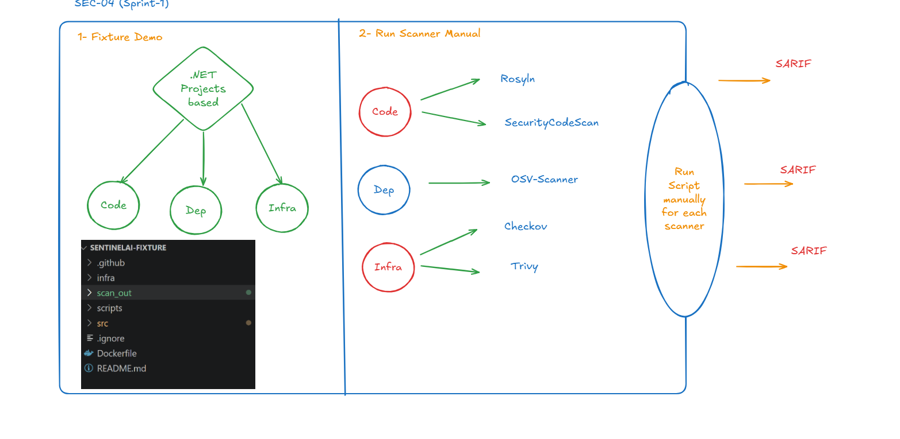

# SEC-04 — Demo Fixture (Three-Layer Vulnerable App)

**Repo:** `sentinelai-fixtures`
**Epic:** E0 — Foundations & Agent Skeleton
**Points:** 5 · **Priority:** P0
**Depends on:** SEC-03 (Canonical Data Contracts)

---

## What this ticket is

Author the authored, deliberately-vulnerable **three-layer fixture** that every downstream SentinelAI component is demonstrated and regression-tested against. This is the fixture that produces the flagship "golden chain":

> **CWE-502 unsafe deserialization → wildcard IAM policy → S3 target**

Without this fixture, none of the scanner, graph, retrieval, or debate work has anything real to run against.

---

## Scope

| Layer | What was authored | Why |
|-------|--------------------|-----|
| **Dependency** | Vulnerable NuGet package (`Newtonsoft.Json`) + `packages.lock.json` | Gives OSV-Scanner a real CVE/GHSA finding and lets the dep→code seam resolve |
| **Code** | ASP.NET Core Web API service with an unsafe-deserialization weakness (CWE-502) | Gives Roslyn/SCS a real code-layer finding |
| **Infra** | Dockerfile + Terraform with an over-permissioned IAM role and a "crown jewel" S3 bucket | Gives Trivy and Checkov real infra findings, and creates the IAM→S3 edge for the graph |

The fixture is deliberately authored (not a random vulnerable app) so the **image-name join** (code→infra) and the **role→resource join** (infra→S3) are clean and reliable — this is what makes the full chain reconstructable end-to-end for every demo.

---

## Acceptance criteria

- [ ] All four/five scanners run against the fixture and each layer (code / dep / infra) produces **at least one real finding**.
- [ ] The graph can be built from the fixture's Terraform + Dockerfile + manifests, and the **dep → code → infra → bucket chain is reconstructable end-to-end**.
- [ ] `packages.lock.json` is present so the dependency scanner produces non-empty output and the dep→code seam resolves.

---

## Repository structure

*(Diagram: runner side — `sentinelai-action` running secret pre-scan, scanners, and graph-input collection against this fixture — packaged into a bundle and posted to `sentinelai-backend`.)*

---

## Notes / open items

- This fixture is the shared dependency for **SEC-11/SEC-12** (scanner runners), **SEC-17–SEC-20** (resource graph & chaining), and **SEC-44** (end-to-end demo) — any change to file paths, package names, or Terraform resource names here can silently break those downstream seams.
- Toolchain actually validated against this fixture: **Roslyn/SCS, OSV-Scanner, Trivy, Checkov** (Dependency-Check and Semgrep were dropped from the active toolchain — see SEC-12 notes).
- Checkov and Trivy may disagree on the IAM wildcard finding (Checkov flags only fully unrestricted `Action:"*"`/`Resource:"*"`, not service-scoped wildcards) — this is expected and demonstrates multi-scanner reasoning value, not a fixture defect.

---

## Related tickets

- SEC-03 — Canonical data contracts (dependency)
- SEC-11/SEC-12 — Runner workflow & scanners (consumes this fixture)
- SEC-17–SEC-20 — Resource graph & chaining (consumes this fixture)
- SEC-38 — Ground-truth benchmark corpus (related, separate store)
- SEC-44 — End-to-end demo run (proves the full chain on this fixture)