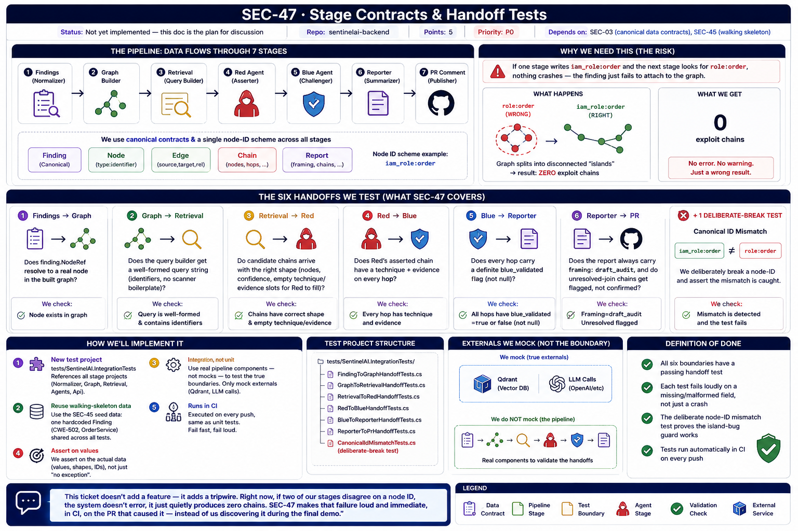

# SEC-47 · Stage Contracts & Handoff Tests

**Status:** Not yet implemented — this doc is the plan for discussion
**Repo:** `sentinelai-backend` · **Points:** 5 · **Priority:** P0
**Depends on:** SEC-03 (canonical data contracts), SEC-45 (walking skeleton)

---

## The idea in one sentence


Write integration tests that check the *data* passed between pipeline stages — not "did it crash," but "is the shape and the ID exactly right" — so a mismatch is caught in CI, not discovered three sprints later as zero exploit chains.

---

## Why we need this

Our pipeline is a chain of stages:

```
Findings → Graph → Retrieval → Red → Blue → Reporter → PR comment
```

Every stage hands the next one data using our canonical contracts (`Finding`, `Node`, `Edge`, `Chain`, `Report`) and a single node-ID scheme (`type:identifier`, e.g. `iam_role:order`).

**The risk:** if one stage writes `iam_role:order` and the next stage looks for `role:order`, nothing throws an exception — the finding just silently fails to attach to the graph. The graph splits into disconnected per-layer "islands," and the result is **zero exploit chains**, with no error anywhere telling us why. This exact bug already happened once in our POC.

SEC-47 exists to catch that class of bug automatically, on every push.

---

## What gets tested — the six handoffs

| # | Boundary | What we check |
|---|----------|----------------|
| 1 | Findings → Graph | Does `finding.NodeRef` resolve to a real node in the built graph? |
| 2 | Graph → Retrieval | Does the query builder get a well-formed query string (identifiers, no scanner boilerplate)? |
| 3 | Retrieval → Red | Do candidate chains arrive with the right shape (nodes, confidence, empty technique/evidence slots for Red to fill)? |
| 4 | Red → Blue | Does Red's asserted chain have a technique + evidence on every hop? |
| 5 | Blue → Reporter | Does every hop carry a definite `blue_validated` flag (not null)? |
| 6 | Reporter → PR | Does the report always carry `framing: draft_audit`, and do unresolved-join chains get flagged, not presented as confirmed? |

Plus **one dedicated test** that deliberately breaks a node-ID (e.g. `role:order` instead of `iam_role:order`) and asserts the mismatch is caught — proof the guard actually works, not just that it exists.

---

## How we'll implement it

1. **New test project** in `sentinelai-backend/tests/SentinelAI.IntegrationTests`, referencing all the stage projects (Normalizer, Graph, Retrieval, Agents, Api).
2. **Reuse the walking-skeleton (SEC-45) seed data** — one hardcoded `Finding` (CWE-502, OrderService) — as the shared fixture across all six tests, so we're not inventing new test data.
3. **One test class per boundary** (6 classes), using real pipeline components — not mocks — because mocking away the boundary defeats the point of an integration test. We only mock true externals (Qdrant, LLM calls).
4. **Assert on values, not just "no exception"** — e.g. `node.Should().NotBeNull()`, `report.Framing.Should().Be("draft_audit")`.
5. **Wire into CI** so these run on every push, same as unit tests.

```
tests/SentinelAI.IntegrationTests/
├── FindingToGraphHandoffTests.cs
├── GraphToRetrievalHandoffTests.cs
├── RetrievalToRedHandoffTests.cs
├── RedToBlueHandoffTests.cs
├── BlueToReporterHandoffTests.cs
├── ReporterToPrHandoffTests.cs
└── CanonicalIdMismatchTests.cs   ← the deliberate-break test
```

---

## Definition of done

- [ ] All six boundaries have a passing handoff test
- [ ] Each test fails loudly on a missing/malformed field, not just a crash
- [ ] The deliberate node-ID mismatch test proves the island-bug guard works
- [ ] Tests run automatically in CI on every push

---

## Talking point for the meeting

> "This ticket doesn't add a feature — it adds a tripwire. Right now, if two of our stages disagree on a node ID, the system doesn't error, it just quietly produces zero chains. SEC-47 makes that failure loud and immediate, in CI, on the PR that caused it — instead of us discovering it during the final demo."